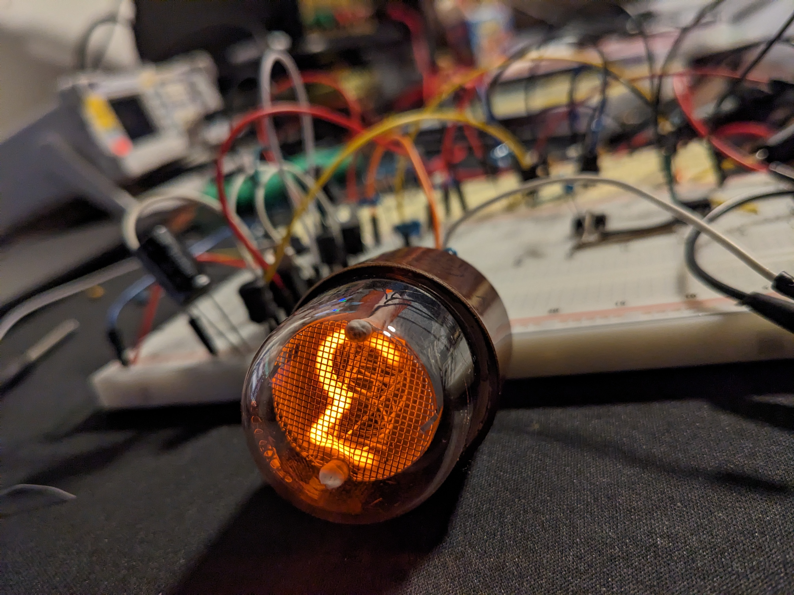
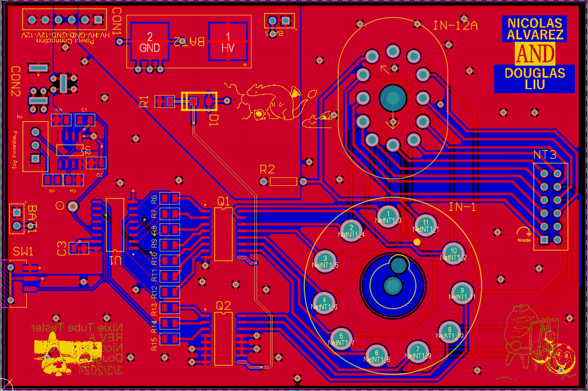
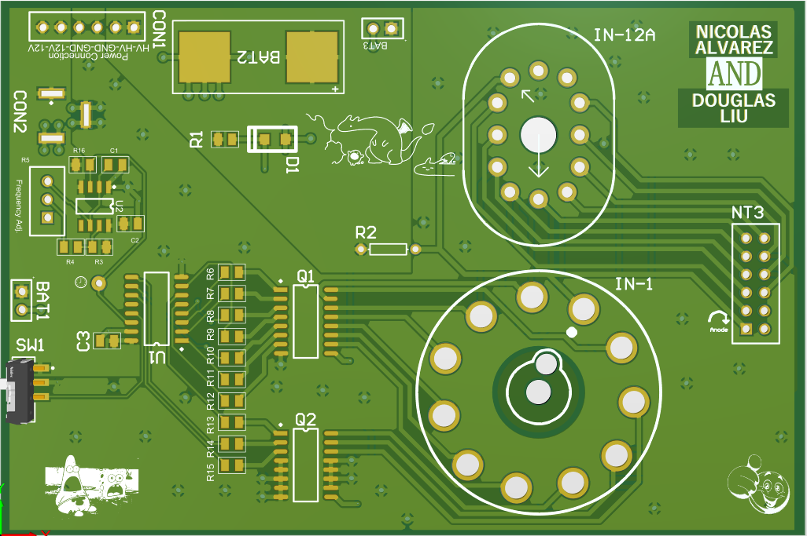

# Nixie_Tester_IN-1_IN-12A

<!-- PROJECT LOGO -->
 

  

  

    A Nixie tube tester that counts from 0 to 9! (CONSTRUCTION AND TESTING IN PROGRESS)
     
  

<!-- USAGE EXAMPLES -->
## How it Works
An external HV supply is required. Look for one that has a maximum voltage output of at least 180V. Eventually, I would like to design my own.

R5 is a variable resistor that can be adjusted to change the speed of clock generated from the astable configured 555-timer.
The output of the 555-timer is to a counter IC that cycles through its 10 outputs.
Those 10 outputs are to Darlington transistor arrays (2 chips) that have a suitable 100V collector-emitter breakdown voltage to handle the required cathode biasing for the nixie tube.
A Zener is biased with a resistor to produce the 91V bias.
180V is a good number to use for a maximum of the HV supply. Any larger than that does not make the nixie tube brighter, and you typically want to run your tubes gently, only to the required voltage for it to turn on to improve tube lifetime.

Use this space to show useful examples of how a project can be used. Additional screenshots, code examples and demos work well in this space. You may also link to more resources.

<!-- ABOUT THE PROJECT -->
## Project Pictures!

  

  

### Software Used

* Altium and Altium Workspace (Free for students!)
* Gerber Viewer 7.0 (Free!)

## Notes to Self and Helpful for Others

A board outline only needs to be created when you want the shape of the board to be different than the basic rectangle that is automatically created as a gerber .GM file.
If you want rounded edges or something, then a board outline is required to define that. The reason I am explaining this is when I sent this board to fab, 
JLC pcb contacted me wondering if I wanted the board outline to be defined by the .GKO or .GM gerber. Turns out 

In the future I will look at the gerber files and NC drill files more closely with Gerber Viewer 7.0 to understand each layer's existence and purpose.
In a future commit I will remove the outline from the keepout layer .GKO to prevent any confusion or delay when getting board fabbed.

<!-- ROADMAP -->
## Roadmap

- [X] Figure out how to bias the cathode and what components to use for cycling through cathodes
- [x] Create footprints for edge connections
- [X] Order board (Used JLC PCB)
- [ ] Remove gerber .GKO Keepout layer outline. Not needed. The .GM layer already takes care of the board outline
- [ ] Assemble and test the board
- [ ] Make any fixes to the board (especially Nixie tube footprints) for it to be a reliable design for others
- [ ] Design a simple DC-DC Boost Converter Supply 12V input to max output of 200V (This will be linked to a separate repo eventually)
- [ ] Maybe add 3D CAD models to the components

<!-- CONTACT -->
## Contact

Nicolas Alvarez (README.md Author) - nalvar95@outlook.com - www.linkedin.com/in/nicolas-alvarez-69061b1b6

Douglas Liu - https://www.linkedin.com/in/liudouglas/

<!-- ACKNOWLEDGMENTS -->
## Acknowledgments

* [Threeneuron](https://threeneurons.wordpress.com/nixie-power-supply/)
* [Markdown Guide](https://www.markdownguide.org/basic-syntax/#reference-style-links)
* [Footprint Reference Guide](https://www.slideshare.net/abishus/smt-notes)

:smile:

(<a href="#readme-top">back to top</a>)

