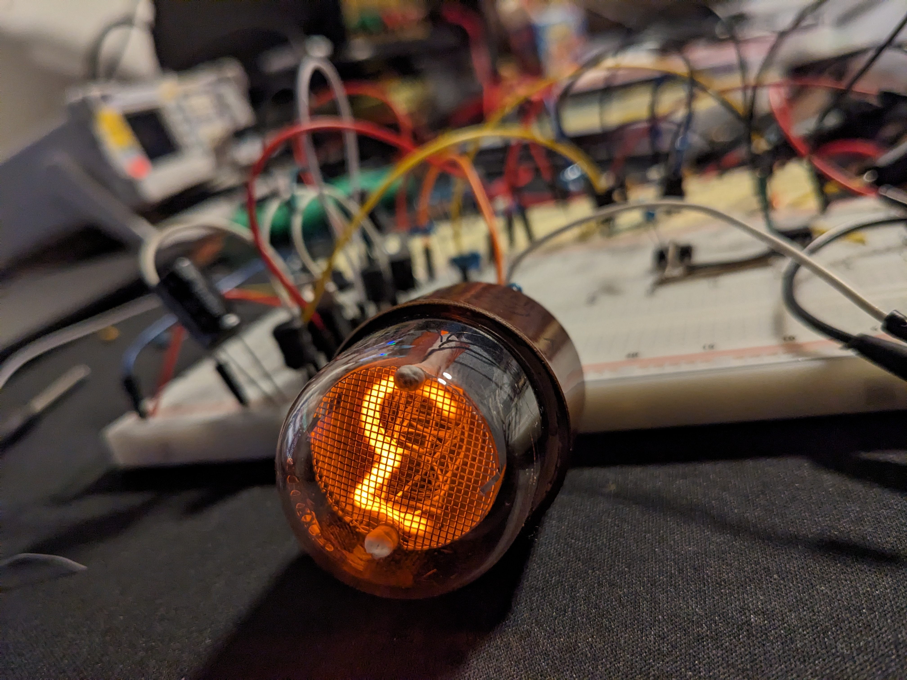

# Nixie_Tester_IN-1_IN-12A

<!-- PROJECT LOGO -->
 

  

  

    A Nixie tube tester that counts from 0 to 9!
     
  

## The Nixie Tube
The orange glow is not a resistive glow produced by heat. 

The wire mesh you see 

## The Nixie Tester
1. Astable 555 timer clocks a counter IC at a specified speed (Using a varistor) 
2. Every nixie digit is an anode. When grounded, current flows through the digit.
3. Each darlington pair, when powered, ground each digit (anode) of the nixie tube allowing it to count up
4. Orange GLOW!

## More Detail
- An external HV supply is required. Look for one that has a maximum voltage output of at least 180V.
- For the IN-1 Nixie tube, look for "100 PCS Delphi MOLEX automotive 0002091102 Socket Contact Tin 14-20 AWG FEMALE" on Ebay
- R5 is a variable resistor that can be adjusted to change the speed of clock generated from the astable configured 555-timer.
- The output of the 555-timer acts as the clock for a counter IC that cycles through its 10 outputs.
- Those 10 outputs are input to 2 Darlington Arrays (chips) that have a 100V collector-emitter breakdown voltage to handle the required cathode biasing for the nixie tube.
- A Zener is biased with a resistor to produce the 91V cathode bias.

## Project Pictures!

  

  

https://github.com/user-attachments/assets/7158ab72-1c5b-4f93-8375-850d6015da81

### Software and Resources Used

* Altium and Altium Workspace (Free for students!)
* Gerber Viewer 7.0 (Free!)
  
* [Threeneuron](https://threeneurons.wordpress.com/nixie-power-supply/)
* [Nixie Drawing Figure](https://www.vcalc.net/display2.htm)

* [Markdown Guide](https://www.markdownguide.org/basic-syntax/#reference-style-links)
* [Footprint Reference Guide](https://www.slideshare.net/abishus/smt-notes)
* [IN-1 Socket Contact](https://www.ebay.com/itm/302480301206?_skw=100+PCS+Delphi+MOLEX+automotive+0002091102)

## Lessons Learned
* Empirically proven, any larger than 180V does not make the nixie tube any visibly brighter. Better to run at 180V or lower to preserve tube lifetime.
* Remove the outline from the keepout layer .GKO to prevent any confusion or delay when getting the board fabbed.
* Surface-mount soldering is easier said than done. Easier if you have higher-quality tools, more specifically an inductive rather than resistive heating iron.

## To-Do

- [X] Figure out how to bias the cathode and what components to use for cycling through cathodes
- [x] Create footprints for edge connections
- [X] Order board (Used JLC PCB)
- [X] Remove gerber .GKO Keepout layer outline. Not needed. The .GM layer already takes care of the board outline
- [X] Assemble and test the board
- [X] Make any fixes to the board (especially Nixie tube footprints) for it to be a reliable design for others
~~- [ ] Design a simple DC-DC Boost Converter Supply 12V input to max output of 200V (This will be linked to a separate repo eventually)~~

## Contact

Nicolas Alvarez - nalvar95@outlook.com - www.linkedin.com/in/nicolas-alvarez-69061b1b6
Douglas Liu - https://www.linkedin.com/in/liudouglas/

:smile:

(<a href="#readme-top">back to top</a>)

