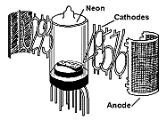
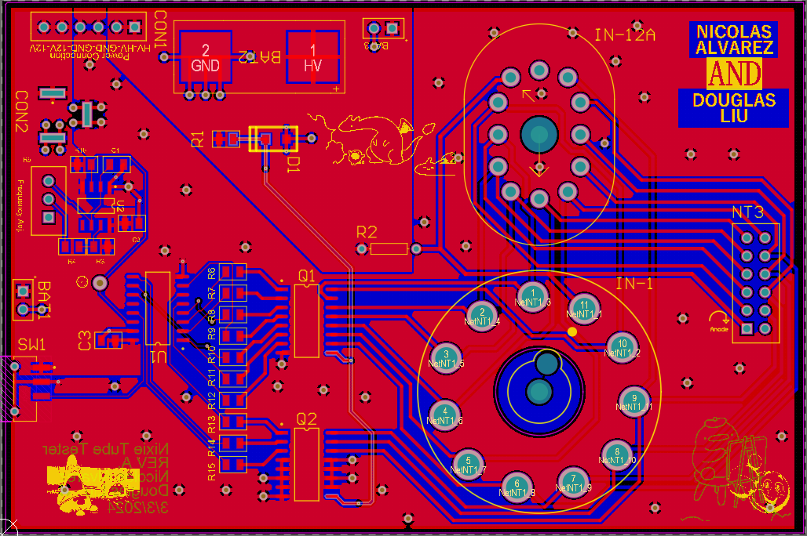
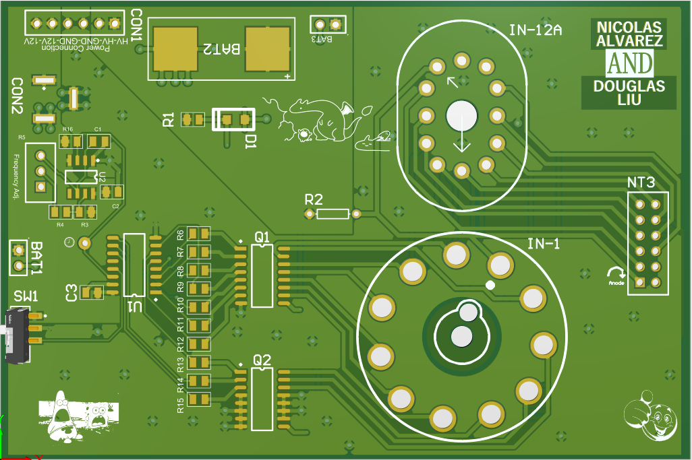

# Nixie Tube Tester - IN-1 and IN-12A

  <video src="media/nixietubetesterdemo.mp4" controls width="800"></video>

## The Nixie Tube

First, here are the parts of a nixie tube.
  * The Grid    - The anode, is the wire-mesh tied to HV (high-voltage ~160 to 180V) 
  * The Digits  - Each digit is a ceramically separated cathode
  * The Gas     - Inert low-pressure gas mixture, primarily Neon
  * The Tube    - Air-tight glass tube to keep gas inside
  
  The orange glow is not a resistive glow produced by heat.  Instead, the glow is produced
  by a combination of mid-air collisions between gas ions and electrons moving in opposite directions
  and sputtering caused by positive ions hitting the cathode digit directly.
  
  The Nixie tube is a current-driven device and requires an anode resistor between the grid and HV.
  Every digit can be individually controlled via a transistor tying the cathode to ground when powered.

  

## The Nixie Tester

1. Astable 555 timer clocks a Counter chip that cycles through its 10 outputs.
2. Every output from the Counter chip is tied to the base of a transistor darlington pair.
3. Orange glow occurs when the transistor is turned on and completes the circuit from HV to ground.`

## More Detail

- An external HV supply is required. Look for one that has a maximum voltage output of at least 180V.
- For the IN-1 Nixie tube, look for "100 PCS Delphi MOLEX automotive 0002091102 Socket Contact Tin 14-20 AWG FEMALE" on Ebay
- R5 is a variable resistor that can be adjusted to change the speed of clock generated from the astable configured 555-timer.
- The output of the 555-timer acts as the clock for a counter IC that cycles through its 10 outputs.
- Those 10 outputs are input to 2 Darlington Arrays (chips) that have a 100V collector-emitter breakdown voltage to handle the required cathode biasing for the nixie tube.
- A Zener is biased with a resistor to produce the 91V cathode bias.

## Photos

  

  

### Tools

* Altium and Altium Workspace
* Gerber Viewer 7.0

### References

* [Threeneuron](https://threeneurons.wordpress.com/nixie-power-supply/)
* [Nixie Tube Figure](https://www.vcalc.net/display2.htm)
* [Markdown Guide](https://www.markdownguide.org/basic-syntax/#reference-style-links)
* [Footprint Reference Guide](https://www.slideshare.net/abishus/smt-notes)
* [IN-1 Socket Contact](https://www.ebay.com/itm/302480301206?_skw=100+PCS+Delphi+MOLEX+automotive+0002091102)
* [Nixie Tube](https://www.explainthatstuff.com/how-nixie-tubes-work.html)

## Lessons Learned

* Empirically proven, any larger than 180V does not make the nixie tube any visibly brighter. Better to run at 180V or lower to preserve tube lifetime.
* Remove the outline from the keepout layer .GKO to prevent any confusion or delay when getting the board fabbed.
* Surface-mount soldering is easier said than done. Easier if you have higher-quality tools, more specifically an inductive rather than resistive heating iron.

## To-Do

- [X] Figure out how to bias the cathode and what components to use for cycling through cathodes
- [x] Create footprints for edge connections
- [X] Order board (Used JLC PCB)
- [X] Remove gerber .GKO Keepout layer outline. Not needed. The .GM layer already takes care of the board outline
- [X] Assemble and test the board
- [X] Make any fixes to the board (especially Nixie tube footprints) for it to be a reliable design for others